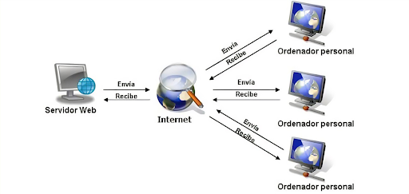

# 0373-A2-SergiNebot
1. ¿Qué es una página web?

No se definirlo


2. ¿Qué es un servidor web?

Un servidor web sirve para publicar las páginas web que se han creado

3. ¿Qué son los lenguajes de marcas? ¿Cuántos conoces? 

- HTML
- CSS
- Javascript

4. ¿Qué es HTML ? ¿Sabes cómo se estructura?

Es un lenguaje que sirve principalmente para crear páginas web, programas, etc…

```
<!DOCTYPE html>
<html lang="en">
<head>
    <meta charset="UTF-8">
    <meta name="viewport" content="width=device-width, initial-scale=1.0">
    <title>Document</title>
</head>
<body>
    
</body>
</html>
```
_Figura 1: Estructura de código HTML_

5. ¿Qué es CSS?

Es un archivo que sirve para retocar el aspecto de una página web


6. ¿Sabes cómo funciona un navegador web? Describe brevemente el proceso que se sigue para visualizar una página web.:

Programas la página web con los comandos, textos, luego configuras el css para que la
página web se vea bien y por último tendremos que encender el servidor web para poder
subir pagina web que hemos creado y configurado.



_Figura 2: Esquema de peticiones HTML_